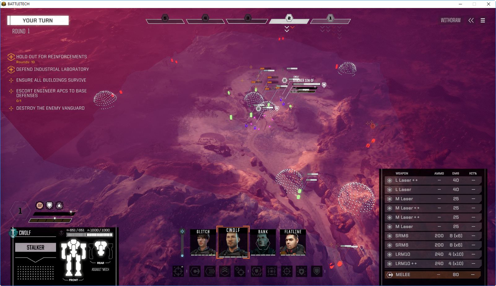

# BattleTech Debug Mod

A HBS BattleTech mod to provide debug related functionality

## Features

- **Scene Inspector** - `alt + i` - Toggles the scene hierarchy viewer and inspector on and off
  - **Search** - Use the `Search` tab to search the game scene for object name or for objects that have a specific component type.
  - **Toggle Debug Mode** - `alt + a` - Toggles the inspector debug mode on and off. Debug mode shows more hidden variables and properties.
  - **Click to Highlight** - `ctrl + left mouse click` on a hierarchy item or search result to highlight the UI or gameobject
- **Toggle Fog of War** - `alt + f` - Toggles the fog of war on and off. Optionally, can keep the dark overlay with a setting in the mod.json
- **Toggle Freeform Camera** - `alt + c` - Toggles between the normal BT camera and a debug freeform fly camera
- **Toggle Gizmo Mode** - `alt + g` - Toggles in-combat gizmos to display such as spawn points, regions and the encounter boundary
  - **Toggle Region Gizmo** - `alt + r` - Toggles full region view mode on or off. When on, it shows the region entirely, when off it shows just the edges as dots.
- **Toggle UI** - `alt + u` - Toggles UI on or off (tested for combat mostly)

## Special Thanks

- [Süleyman Yasir KULA](https://github.com/yasirkula) - [Unity runtime inspector](https://github.com/yasirkula/UnityRuntimeInspector)

## Author

Richard Griffiths (CWolf)

- [Twitter](https://twitter.com/CWolf)
- [LinkedIn](https://www.linkedin.com/in/richard-griffiths-436b7a19/)
