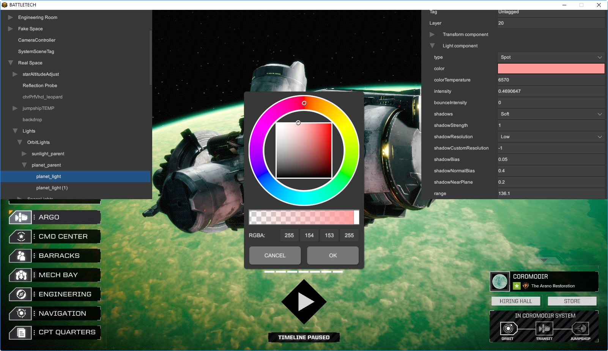
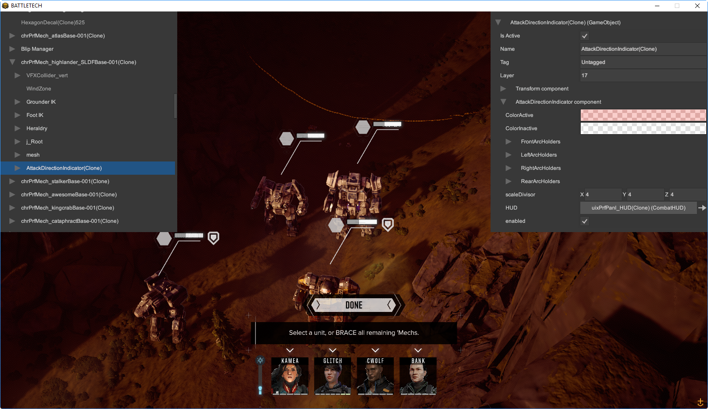

# BattleTech Debug Mod

A HBS BattleTech mod to provide debug related functionality

## Features

* __Scene Inspector__ - `alt + i` - Toggles the scene hierarchy viewer and inspector on and off
    * __Toggle Debug Mode__ - `alt + a` - Toggles the inspector debug mode on and off. Debug mode shows more hidden variables and properties.
* __Toggle Fog of War__ - `alt + f` - Toggles the fog of war on and off. Optionally, can keep the dark overlay with a setting in the mod.json
* __Toggle Freeform Camera__ - `alt + c` - Toggles between the normal BT camera and a debug freeform fly camera
* __Toggle Gizmo Mode__ - `alt + g` - Toggles in-combat gizmos to display such as spawn points, regions and the encounter boundary
    * __Toggle Region Gizmo__ - `alt + r` - Toggles full region view mode on or off. When on, it shows the region entirely, when off it shows just the edges as dots.
* __Scene Dump__ - `alt + d` - Dumps the scene tree hierarchy into the log file. It dumps only active gameobjects and enabled components

## Special Thanks

* [Süleyman Yasir KULA](https://github.com/yasirkula) - [Unity runtime inspector](https://github.com/yasirkula/UnityRuntimeInspector)

## Author

Richard Griffiths (CWolf)
  * [Twitter](https://twitter.com/CWolf)
  * [LinkedIn](https://www.linkedin.com/in/richard-griffiths-436b7a19/)